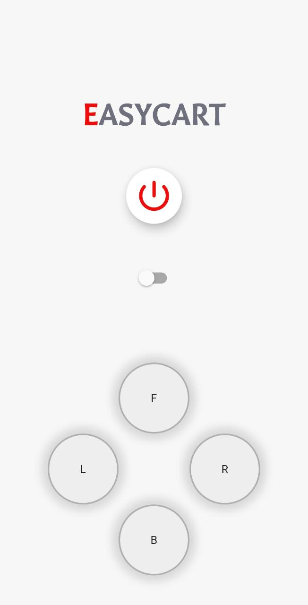

# Joypad-Bluetooth-Controller
  
 
## Features Used: 
- [X] Firebase Mobile Authentication
- [X] Firebase Firestore
- [X] Joypad Controller
- [X] Bluetooth Serial Communiication
 

## Guidelines: 
### App: 
<ul>
  <li> Install app via apk </li>
  <li> Login using mobile number and otp</li>
  <li> Add personal details</li>
  <li> enable bluetooth </li>
  <li> click find nearby devices and long press to connect </li>
  <li> Use padbutton view or joypadview to test </li>
  </ul>
   
  
### Device: 
<ul>
  <li> Ardiuno and HC05 is needed for testing </li>
  <li> Run ardiuno code in IDE </li>
  </ul>
   
  
## User Interface:  
<table>
  <tr>
    <td> </td>
    <td> </td>
  </tr>
  <tr>
    <td> </td>
    <td> </td>
  </tr>
  <tr>
    <td> </td>
    <td> </td>
  </tr>
  <tr>
    <td> </td>
    <td> </td>
  </tr>
</table>
